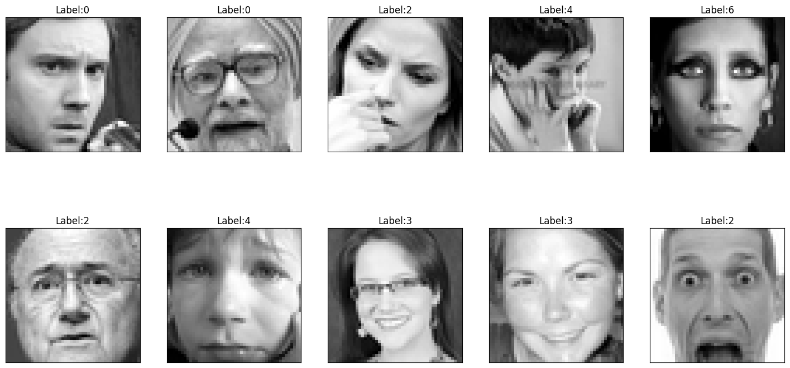
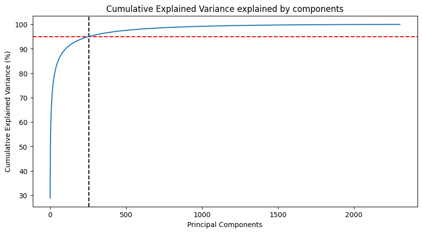
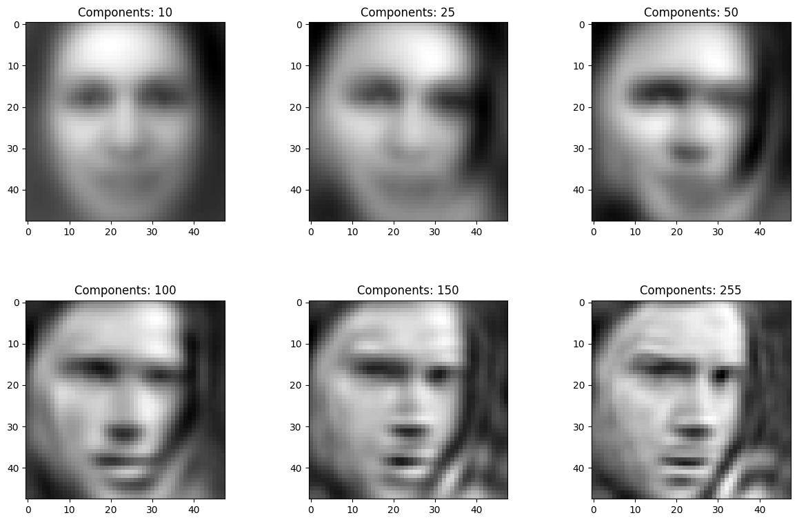
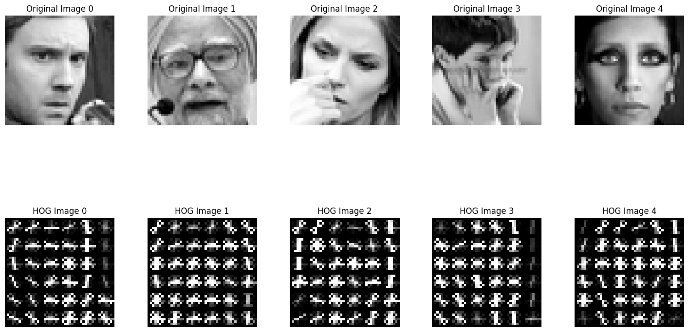
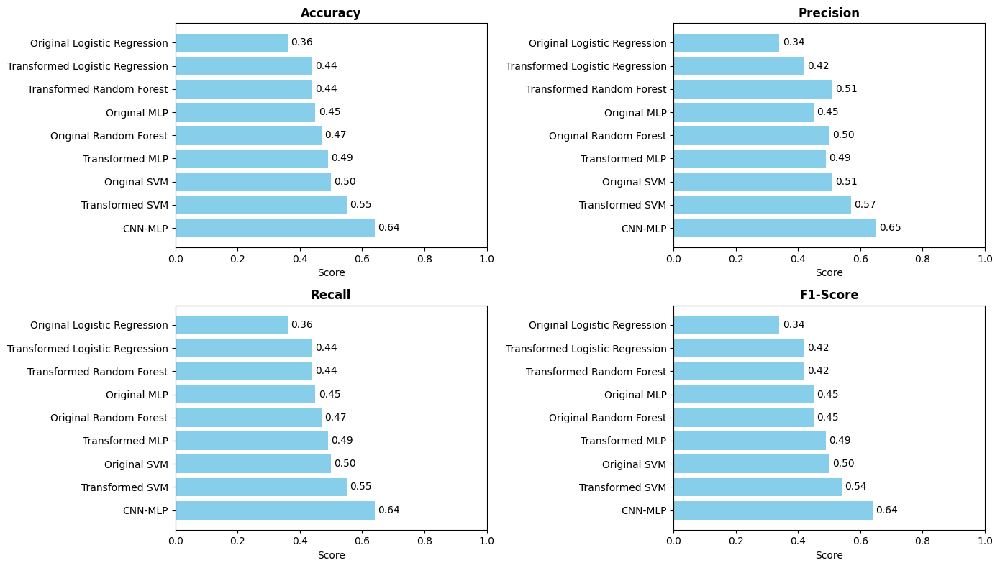
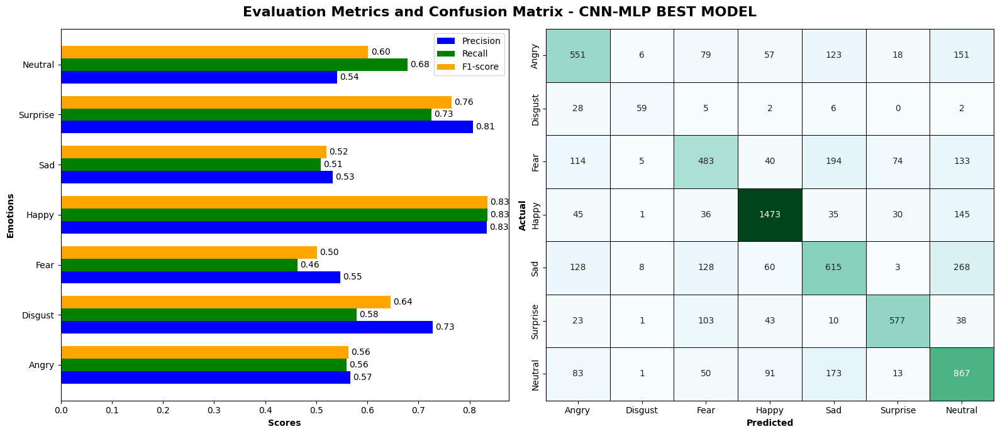

# Mini-Project for Fundamentals of Machine Learning Course

This repository contains the code and data for a mini-project on facial expression recognition using machine learning algorithms.

## 📑 Project Policy
- Team: group should consist of 3-4 students.

    |No.| Student Name    | Student ID |
    | --------| -------- | ------- |
    |1|Nguyễn Công Hoài Nam|21280099|
    |2|Lê Nguyễn Hoàng Uyên|21280118|
    |3|Huỳnh Công Đức|21280124|
    |4|Trần Thị Uyên Nhi|21280125|

- The submission deadline is strict: **11:59 PM** on **June 22nd, 2024**. Commits pushed after this deadline will not be considered.

## 📦 Project Structure

The repository is organized into the following directories:

- **/data**: This directory contains the facial expression dataset. You'll need to download the dataset and place it here before running the notebooks. (Download link provided below)
- **/notebooks**: This directory contains the Jupyter notebook ```EDA.ipynb```. This notebook guides you through exploratory data analysis (EDA) and classification tasks.

## ⚙️ Usage

This project is designed to be completed in the following steps:

1. **Fork the Project**: Click on the ```Fork``` button on the top right corner of this repository, this will create a copy of the repository in your own GitHub account. Complete the table at the top by entering your team member names.

2. **Download the Dataset**: Download the facial expression dataset from the following [link](https://mega.nz/file/foM2wDaa#GPGyspdUB2WV-fATL-ZvYj3i4FqgbVKyct413gxg3rE) and place it in the **/data** directory:

3. **Complete the Tasks**: Open the ```notebooks/EDA.ipynb``` notebook in your Jupyter Notebook environment. The notebook is designed to guide you through various tasks, including:
    
    1. Prerequisite
    2. Principle Component Analysis
    3. Image Classification
    4. Evaluating Classification Performance 

    Make sure to run all the code cells in the ```EDA.ipynb``` notebook and ensure they produce output before committing and pushing your changes.

5. **Commit and Push Your Changes**: Once you've completed the tasks outlined in the notebook, commit your changes to your local repository and push them to your forked repository on GitHub.


Feel free to modify and extend the notebook to explore further aspects of the data and experiment with different algorithms. Good luck.

## 📦 Process

1. **Prerequisite**

    This section provides some basic steps for accessing and visualizing the dataset.

    The data consists of grayscale images of faces, each measuring 48x48 pixels. The faces have been automatically aligned to be roughly centered and occupy a similar area within each image. The task is  
to categorize each face based on the emotion expressed, assigning it to one of seven categories (0=Angry, 1=Disgust, 2=Fear, 3=Happy, 4=Sad, 5=Surprise, 6=Neutral). The dataset contains a total of 35,887 examples.

    

2. **Principle Component Analysis**

    
    From 0 to 500 principal components, there is a sharp rise in explained variance initially, indicating that these components capture a significant amount of the data's variance. 

    The subsequent components only increase the explained variance slightly, making their contribution negligible. 

    Therefore, choosing a threshold of 95% explained variance is reasonable as it captures most of the data's variance while significantly reducing the dimensionality.

    Visualizing the first image with different principal components
    

3. **Image Classification**

    **PIPELINE**

    | **Steps**                   | **Note**                           |  
    |-----------------------------|------------------------------------|
    | `DescriptorHOG`             | Feature descriptor                 |
    | `PCA`                       | Reduce dimension, keep 90% of data |
    | `Standard Scaler`           | Normalize data                     |
    | `Classification Algorithms` | Model methods                      |

    **Histograms of Oriented Gradients (HOG)**

    ---

    A popular feature descriptor technique in computer vision and image processing. This descriptor computes the change in pixel values around a point of interest. This change is given by a gradient $\vec{G}$ (change vector) whose magnitude ($m$) and angle ($\theta$) are given by equations 1 and 2:
    
    $$m(x,y) = \sqrt{\vec{G}(x,y)\cdot\vec{G}(x,y)} = \sqrt{\left(G_{x}(x,y)\right)^{2} + \left(G_{y}(x,y)\right)^{2}} \tag{1}$$

    $$\theta(x,y) = \tan^{1} \frac{G_y (x,y)}{G_x (x,y) } \tag{2}$$

    

    We will tune the hyperparameters of this pipeline with `GridSearchCV` using a parameter grid based on each model to find the best fine-tuned model.

    The classification methods include: `Random Forest`, `Logistic Regression`, `Support Vector Machine (SVM)`, and `multi-layer perceptron (MLP)`.

    We will compare each classification method on 2 datasets:
    - **Original Data**: the original data (without HOG and PCA)
    - **Transformed Data**: full pipeline

    > **Note**: In MLP, there are additional models with simple CNNs using Keras and TensorFlow to improve performance (to be discussed later).

4. **Evaluating Classification Performance**

    
   
    - As we can see, the model consistently shows higher performance when applied to transformed data compared to original data. This effect is due to dimensionality reduction (PCA and HOG), which reduces memory and time consumption while retaining key data components.
    - The CNN_MLP model demonstrates the best performance as expected in large datasets.
    - Following that is the SVM model.

   **Emotion Category Analysis**
   
    
    - Most Accurate (Highest Precision and Recall):
    
      + Happy: Precision (0.83), Recall (0.83), F1-score (0.83)
      + Surprise: Precision (0.81), Recall (0.73), F1-score (0.76)
    - Most Errors (Lowest Precision and Recall):
    
      + Fear: Precision (0.55), Recall (0.46), F1-score (0.50)
      + Disgust: Precision (0.73), Recall (0.58), F1-score (0.64) - although better than Fear, still relatively lower in recall.
    
    - Happy and Surprise categories are the easiest for the CNN-MLP model to predict accurately, likely due to distinct and consistent patterns in data for these emotions.
    - Fear and Disgust are the most challenging, possibly due to their subtle and overlapping expressions, making them harder to distinguish.
    
    **Winner Model: CNN-MLP with 64% accuracy**
